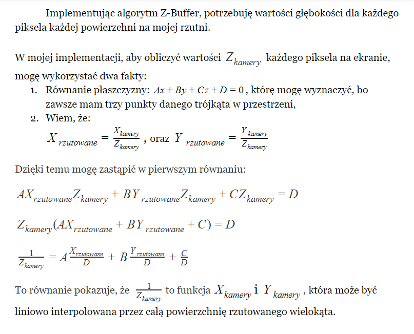

# virtual-cam
Very simple 3d engine.   
<ul>
<li>allows creating shapes in 3d space</li>
<li>allows moving and rotating the camera around 3d items</li>
<li>uses Z-Buffer to omit hidden surfaces</li>
</ul>

  

